# Introduction to Jenkins

This project provides an introduction to **Jenkins**, a powerful and
widely used Continuous Integration and Continuous Delivery (CI/CD) tool
for automating software development workflows. It covers the
foundational concepts of CI/CD, installation and configuration of
Jenkins, navigating the Jenkins user interface, creating and managing
jobs, and automating software builds, tests, and deployments.

## Installing Jenkins

### Step 1: Update Packages

Ensure all packages in your Linux environment are up to date:

``` bash
sudo apt update
```

### Step 2: Install JDK

Jenkins requires Java to run. Install the default JDK with:

``` bash
sudo apt install default-jdk-headless
```

### Step 3: Install Jenkins

Add the Jenkins repository, import the GPG key, update the package list,
and install Jenkins:

``` bash
wget -q -O - https://pkg.jenkins.io/debian-stable/jenkins.io.key | sudo apt-key add -
sudo sh -c 'echo deb https://pkg.jenkins.io/debian-stable binary/ > /etc/apt/sources.list.d/jenkins.list'
sudo apt update
sudo apt-get install jenkins
```

### Step 4: Verify Installation

Check the Jenkins service status:

``` bash
sudo systemctl status jenkins
```

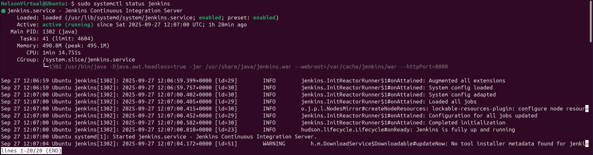

## Setting Up Jenkins

Open your web browser and navigate to:

`http://localhost:8080`

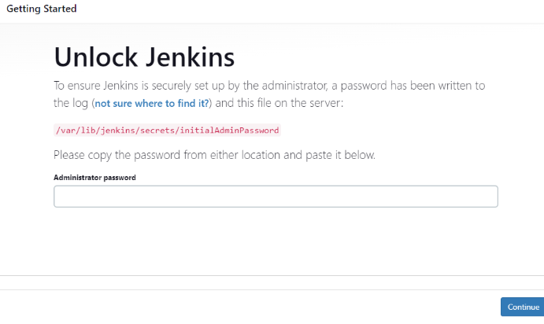

Retrieve the initial admin password from your terminal:

``` bash
cat /var/lib/jenkins/secrets/initialAdminPassword
```

Paste the password in the web UI and click **Continue**.\
Next, select **Install suggested plugins** to complete setup.

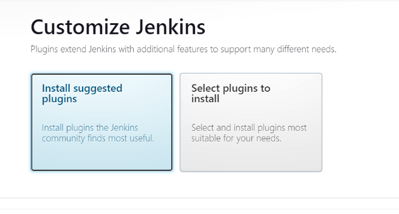

Then, create your first admin user:

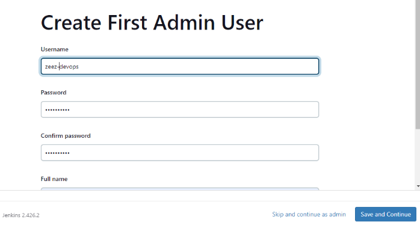

Log in with your newly created account:

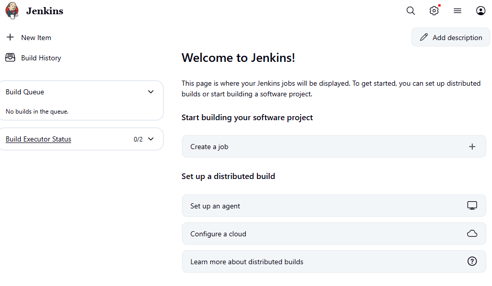

## Creating a Freestyle Project

In Jenkins, a **job** is a task that automates parts of the build or
deployment process, such as compiling code, running tests, or packaging
applications.

From the Jenkins dashboard, click **New Item**:

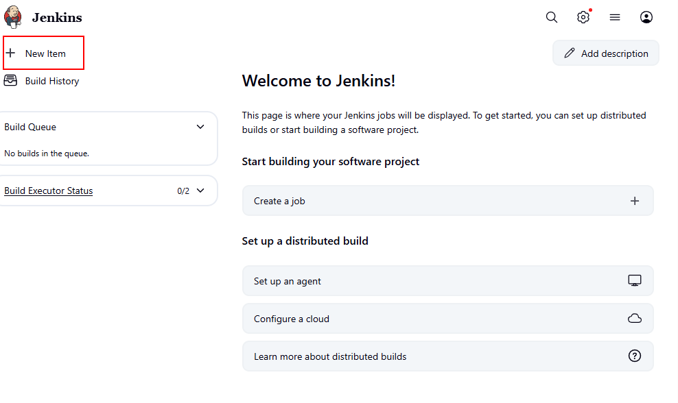

Name the job (e.g., `my-first-job`), select **Freestyle project**, and
click **OK**.

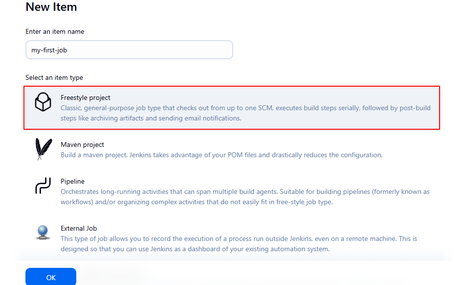

Next, create a GitHub repository (e.g., `jenkins-scm`) with a
`README.md` file:

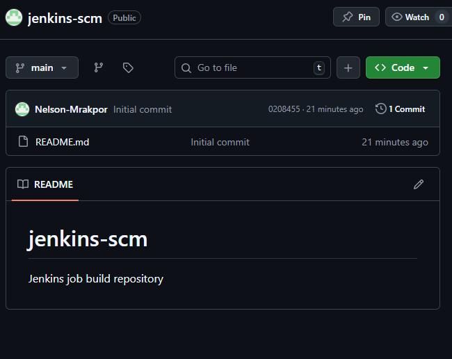

Back in Jenkins, open your project configuration, select **Git** under
**Source Code Management**, and provide your repository URL and GitHub
Personal Access Token. Choose the branch `*/main` and save.

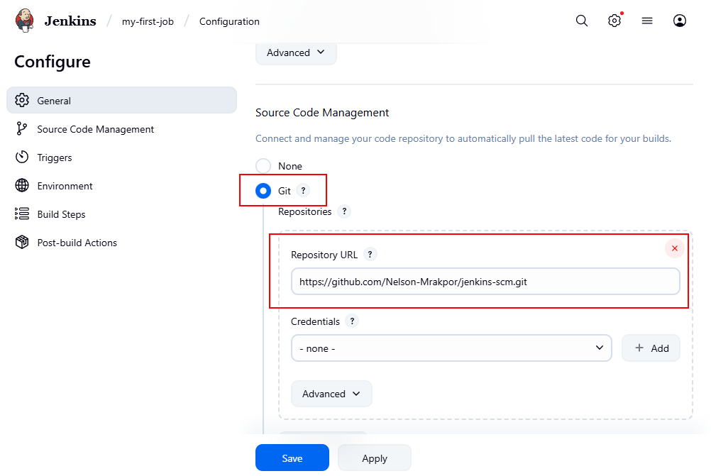

Return to the Jenkins dashboard, click the job name, and select **Build
Now** to run your first build.\
At this point, Jenkins is successfully connected to your GitHub
repository.

## Configuring Build Triggers

To automate builds when changes are made to the repository, configure a
build trigger.

From your project configuration page, scroll to **Build Triggers** and
enable **GitHub hook trigger for GITScm polling**.

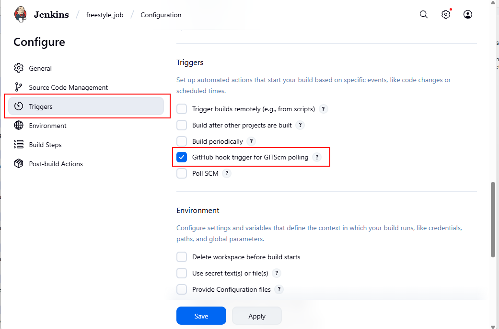

### Creating a github webhook.
In your GitHub repo click on;

`Settings` > `Webhook` > `Add Webhook`

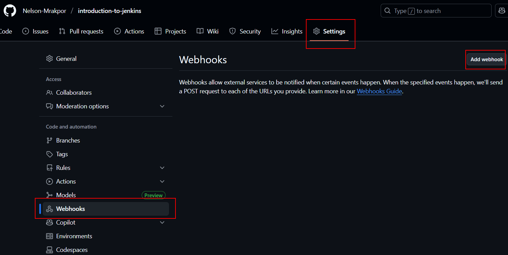

On the add webhook page enter the following configuration and click on `Add Webhook`

`Payload URL:`

http://<EC2_PUBLIC_IP_OR_ELASTIC_IP>:8080/github-webhook/

`Content type:` application/json

`Which events would you like to trigger this webhook?`

Select `Send me everything` for this example.

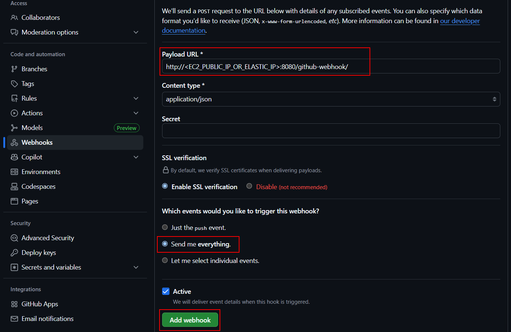

GitHub will send a test ping to Jenkins confirming successful connection. A `Response 200` indicates that the ping was successful

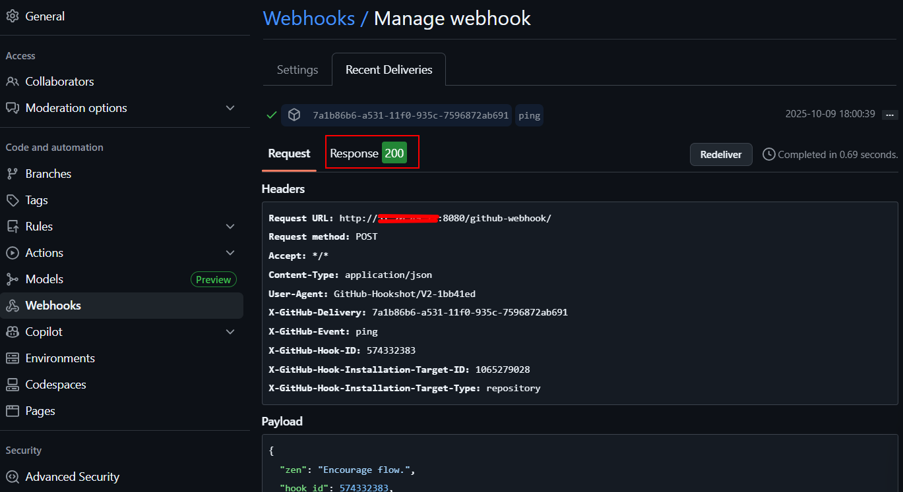

With your webhook created any changes made and pushed to github will trigger a build in Jenkins.


## Conclusion

This project demonstrates the fundamental setup and workflow of Jenkins as a CI/CD automation tool. From installation and initial configuration to creating jobs, connecting GitHub repositories, and automating builds through webhooks, you now have a complete understanding of how Jenkins streamlines software delivery.

By integrating Jenkins with version control systems like GitHub, developers can ensure faster, more reliable, and consistent build and deployment pipelines. With this foundation in place, you can extend your Jenkins setup to include advanced automation—such as pipeline scripts, Docker integration, testing stages, and deployment to production environments.

Jenkins serves as a cornerstone for modern DevOps practices, enabling teams to achieve continuous integration, continuous delivery, and continuous improvement in their development processes.